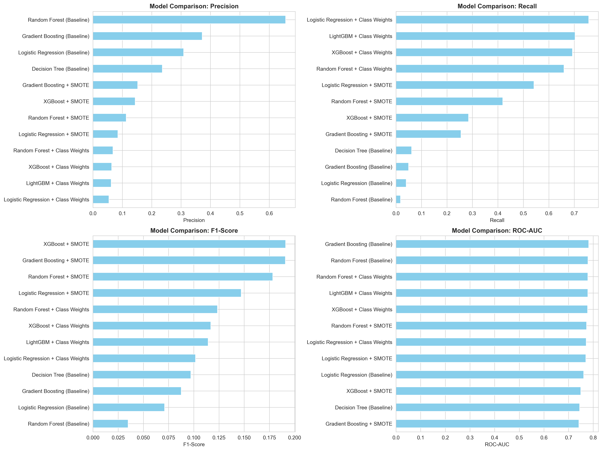
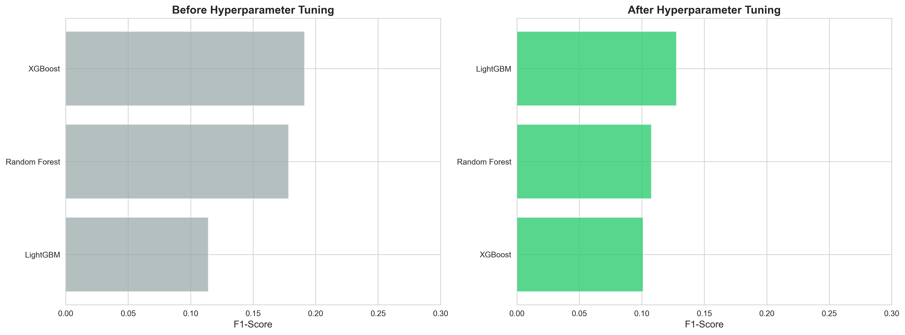
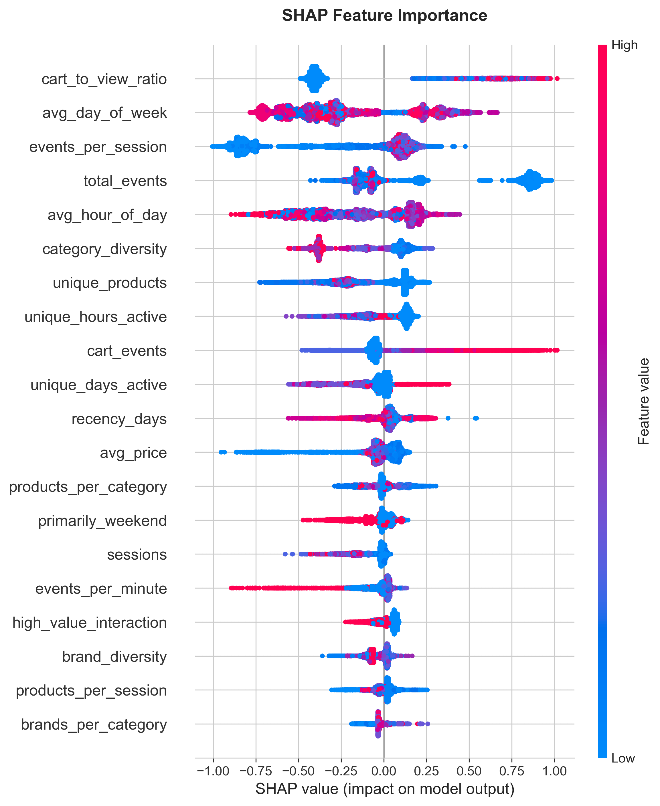

# E-Commerce Customer Purchase Prediction

**Lakshmi Narayanan MP**  
UC Berkeley Professional Certificate in Machine Learning & AI

---

## Executive Summary

**Project Goal:** Predict which e-commerce customers will make purchases based on their browsing behavior.

**Approach:** Using 67.5 million customer interaction events from November 2019, I trained 15 classification models with proper time-based validation to prevent data leakage. The dataset was split chronologically: observation windows to predict future purchases, simulating real-world scenario.

**Key Findings:** 
- **Best Model:** XGBoost with SMOTE balancing achieved **F1-Score: 0.1911** and **ROC-AUC: 0.7497**
- **Top Predictor:** Cart events is the strongest predictor
- **User Cohorts:** Returning users convert at **2.4x higher rate** (4.13% vs 1.72% conversion)
- **Class Imbalance:** Addressed severe 48.7:1 imbalance using SMOTE (synthetic oversampling)
- **Speed:** Fast model training
- **Hyperparameter Tuning:** Tuned models showed worse performance due to CV optimization on SMOTE-balanced data vs real imbalanced test data

**Business Impact:**
- **Conversion Optimization:** Model can identify 28.5% of likely purchasers with 14.4% precision
- **Marketing Efficiency:** Enable targeted campaigns to high-intent users
- **Resource Allocation:** Focus retention efforts on returning users (4.13% conversion vs 1.72% for new users)

**Key Recommendations:**
1. Implement cart abandonment recovery campaign
2. Deploy cohort-specific strategies for new vs returning users
3. Real-time scoring system to flag high-intent users
4. Full personalization engine based on purchase probability and user history

---

## Rationale

E-commerce has low conversion rates. Without knowing who will buy, companies waste money marketing to uninterested users. This project builds a model to identify high-intent customers.

---

## Research Question

**Can we predict which e-commerce customers will make a purchase based on their browsing behavior?**

Specifically:
- What behavioral features most strongly predict purchases?
- How do cart interactions influence purchase probability?
- Can we identify high-intent customers?

---

## Data Sources

**Dataset:** Kaggle E-Commerce Events Dataset (November 2019)  
**Source:** https://www.kaggle.com/datasets/mkechinov/ecommerce-events-history-in-cosmetics-shop/data?select=2019-Nov.csv

**Size:** 67,501,979 user interaction events  
**Event Types:** View, Cart, Purchase  
**Timeframe:** November 1-30, 2019 (30 days)  
**Categories:** Electronics, appliances, accessories, cosmetics

**Data Quality:** 
- No missing values in core fields
- Balanced time coverage across all days

**Chronological Split (Preventing Data Leakage):**
- **Training Set:** Observe Nov 1-10 → Predict purchases Nov 11-15
- **Test Set:** Observe Nov 16-25 → Predict purchases Nov 26-30

**User Breakdown (Test Set):**
- **Returning Users (33.7%):** 4.13% conversion rate
- **New Users (66.3%):** 1.72% conversion rate
- **Observed:** Returning users are 2.4x more likely to buy

**Final Dataset:** 30% sample (577,996 test users, 497,588 train users) for faster processing

---

## Methodology

### Feature Engineering

Created 36 behavioral features, then dropped 5 highly correlated features to get 31 final features:
1. **Behavioral Intensity:** Events, sessions, cart actions
2. **Product Exploration:** Unique products, categories, brands
3. **Price Behavior:** Average price, max price, high-value interactions
4. **Time-Based Patterns:** Recency, time-of-day, weekday patterns
5. **Conversion Signals:** Cart-to-view ratio, session efficiency

**Data Preparation:**
- Time-based windowing to prevent data leakage
- Dropped 5 highly correlated features (correlation > 0.95): days_active, views, views_per_session, views_per_day, session_efficiency
- RobustScaler for skewed features
- SMOTE to address 48.7:1 class imbalance → 2.0:1 balanced

### Model Training

**Models Evaluated:** 15 total across 5 strategies
- **Baseline (4 models):** Logistic Regression, Decision Tree, Random Forest, Gradient Boosting
- **SMOTE (3 models):** Logistic Regression, Random Forest, Gradient Boosting with synthetic oversampling
- **Class Weights (2 models):** Logistic Regression, Random Forest with balanced class weights
- **Advanced Boosting (3 models):** XGBoost + SMOTE, XGBoost + Class Weights, LightGBM + Class Weights
- **Hyperparameter Tuned (3 models):** RandomizedSearchCV on top 3 models (XGBoost, Random Forest, LightGBM)

**Validation:** Sequential train/test split (no random shuffling)

**Note on Hyperparameter Tuning:**
Tuning didn't help because CV was done on balanced SMOTE data (33.3% positive) while testing used real imbalanced data (2.53% positive). The original untuned models performed better (XGBoost + SMOTE: F1=0.1911 vs Tuned: F1=0.1010)

### Model Performance Comparison


*Figure 1: Performance comparison across all 15 models evaluated*


*Figure 2: Before vs After Hyperparameter Tuning - showing the impact of CV data distribution mismatch*

---

## Results

### Best Model: XGBoost + SMOTE

| Metric | Score | Interpretation |
|--------|-------|----------------|
| **F1-Score** | 0.1911 | Balanced precision/recall |
| **ROC-AUC** | 0.7497 | 75% at ranking users correctly |
| **Recall** | 0.2851 | Catches 28.5% of purchasers |
| **Precision** | 0.1437 | 14.4% prediction accuracy |
| **Training Time** | 0.81s | Fast training time |

**Full results for all 15 models:** [results/final_all_models.csv](results/final_all_models.csv)

**Model Comparison:**

| Rank | Model | F1-Score | ROC-AUC |
|------|-------|----------|---------|
| 1st | XGBoost + SMOTE | 0.1911 | 0.7497 |
| 2nd | Gradient Boosting + SMOTE | 0.1909 | 0.7419 |
| 3rd | Random Forest + SMOTE | 0.1784 | 0.7734 |

**Why XGBoost + SMOTE Won:**
- Best F1-Score among all 15 models
- 565x faster than Gradient Boosting (0.81s vs 458.85s)
- Good interpretability with SHAP

---

## Model Interpretability


*Figure 3: Top features driving purchase predictions*

**Top 5 Predictors:**

1. **Cart Events** (r=0.162)
   - 1 cart event: 5% conversion
   - 2-5 cart events: 8% conversion
   - 6+ cart events: 15% conversion
2. **Unique Days Active** — multi-day engagement matters
3. **Unique Hours Active** — separates browsers from buyers
4. **Session Duration** — time spent indicates intent
5. **Total Events** — first interaction is critical

---

## Next Steps

**Recommendations:**
1. **Cart Abandonment Recovery**
   - Target users with cart events
   - Email/SMS within 24 hours
2. **Real-Time Scoring System**
   - Flag high-intent users based on cart + session activity
   - For better marketing ROI
3. **Cohort-Specific Strategies**
   - New users (66%): aggressive first-time discounts
   - Returning users (34%): personalized offers, loyalty rewards
4. **Personalization Engine**
   - Use purchase probability scores to tailor product recommendations
   - Customize messaging based on user history and behavioral signals

**Future Work:**
- Add device, location, referral source features
- Test deep learning models (LSTM/RNN)
- A/B test in production
- Predict customer lifetime value

---

## Outline of Project

- [Notebook 1: Data Preparation & Feature Engineering](1_data_preparation.ipynb)
- [Notebook 2: Exploratory Data Analysis](2_eda.ipynb)
- [Notebook 3: Model Training & Evaluation](3_model_training.ipynb)

---

## Project Structure

```
capstone_workspace/
├── 1_data_preparation.ipynb                 # Data prep & feature engineering
├── 2_eda.ipynb                              # EDA & cohort analysis  
├── 3_model_training.ipynb                   # Model training & SHAP analysis
├── data/phase_1/                            # Processed train/test splits
├── images/models/                           # SHAP & model visualizations
├── results/                                 # Model comparison CSVs
├── README.md                                # This file
└── requirements.txt                         # Python dependencies
```

### Setup & Instructions

**Prerequisites:**
```bash
pip install pandas numpy matplotlib seaborn scikit-learn imbalanced-learn scipy
```

**Running the Project:**
1. **Notebook 1** (15-20 min)
   - Downloads 67.5M events automatically from Kaggle
   - Generates processed data in `data/phase_1/`
   - Creates 4 CSV files: x_train, y_train, x_test, y_test

2. **Notebook 2** (5-10 min)
   - Loads data from `data/phase_1/`
   - Generates EDA visualizations in `images/`

3. **Notebook 3** (40-50 min)
   - Auto-installs xgboost, lightgbm, shap
   - Trains 15 models
   - Generates SHAP plots in `images/models/`
   - Saves results in `results/final_all_models.csv`

**Note:** Run notebooks sequentially (1 → 2 → 3)

---