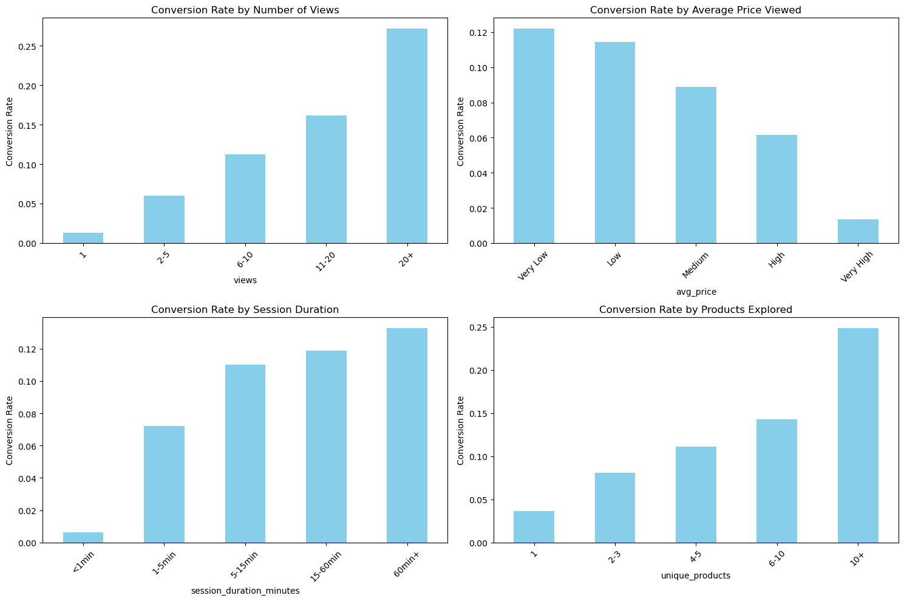
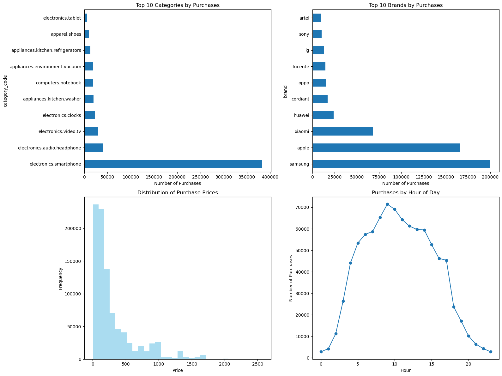

# E-Commerce Customer Purchase Behavior Prediction

**Author**: Lakshmi Narayanan MP

## Executive Summary

This project develops a ML Classification model to predict customer purchase behavior on an e-commerce platform using browsing patterns and session characteristics. Using a large-scale dataset of 67.5 million customer events from browser, was able to achieve strong predictive performance with 93% accuracy and 97% AUC-ROC score.

## Rationale

Understanding customer purchase behavior for e-commerce success.

- **Optimize marketing spend** by targeting high-probability buyers
- **Improve customer experience** through personalized ad recommendations
- **Enhance inventory management** with forecasting for demand
- **Increase revenue** by identifying at-risk customers by reducing churn.

This predictive capability provides competitive advantage in e-commerce marketplace and enables data-driven decision making for marketing, product, and customer success teams.

## Research Question

**How do customer behavior patterns in an e-commerce platform correlate with conversion rates, and can I accurately predict purchase probability based on browsing sessions?**

Specifically this project will focus on:

- Identifying behavioral features that best predict customer purchases
- Understanding how session duration, product exploration, and price preferences impact conversion
- Building a reliable classification model for customer purchase prediction

## Data Sources

**Primary Dataset**: [E-commerce Behavior Data from Multi-Category Store](https://www.kaggle.com/datasets/mkechinov/ecommerce-behavior-data-from-multi-category-store)

**Dataset Characteristics**:

- **Size**: 67.5 million customer events from November 2019
- **Events**: Views, cart additions, purchases across multiple product categories
- **Features**: Event timestamps, product IDs, categories, brands, prices, user sessions
- **Scope**: Multi-category online store with electronics, appliances, clothing, and more

**Full dataset processed**: All 67.5 million events aggregated to 3.7M unique users for analysis and modeling. Processing time for the entire notebook will take around ~35 minutes.

## Methodology

### Data Processing & Feature Engineering

1. **Data Loading**: Direct kaggle URL loading from compressed .gz file.
2. **User Aggregation**: Event-level data aggregated to user-level features
3. **Clean Feature Design**:
   - Session features (ex: session_duration)
   - User interaction (ex: events_per_session)
   - Product features (ex: price_range)

### Exploratory Data Analysis

- **Conversion Analysis**: Conversion rate by user/session features.
- **Category Analysis**: Identified top-converting product categories and brands
- **Correlation Analysis**: Feature correlation matrix

### Machine Learning Models

- **Baseline Models**: Logistic Regression and Random Forest classifiers
- **Pipeline Design**: Sklearn pipelines with preprocessing (imputation, scaling)
- **Evaluation**: Comprehensive metrics including accuracy, precision, recall, F1-score, AUC-ROC

## Results

### Key Business Insights

- **Overall Conversion Rate**: 11.95% of users make purchases
- Following show high conversion rate:

  - Users with 20+ views
  - Users with extended sessions (60+ minutes)
  - Users who explore different products (10+ unique products)

### Model Performance

| Metric        | Logistic Regression | Random Forest |
| --------------- | --------------------- | --------------- |
| **Accuracy**  | 0.93                | 0.93          |
| **Precision** | 0.65                | 0.74          |
| **Recall**    | 0.92                | 0.65          |
| **F1-Score**  | 0.76                | 0.70          |
| **AUC-ROC**   | 0.97                | 0.97          |

### Model Selection

**Logistic Regression** (baseline model):

- **recall (92%)**: Captures 92% of potential buyers vs 65% for Random Forest
- **accuracy (93%)**: Performs well for both buyers and non-buyers

### Top Predictive Features

1. Session duration
2. Events per session
3. Product focus
4. Price range exploration
5. Unique products viewed

## Next Steps

### Advanced Modeling

- **Model Expansion**: Implement Gradient boosting, decision tree and others
- **Hyperparameter Tuning**: Using grid search
- **Model Execution Time**: Time taken to execute each models

### Business Applications

- **Real-time Scoring**: Deploy model for live purchase probability scoring
- **Marketing Automation**: Trigger personalized ad targets for high-probability customers

### Technical Enhancements

- **Data Pipeline**: Automate continuous updates
- **Model Monitoring**: Track performance of each models
- **Scalability**: Implement distributed computing for much larger dataset processing

## Project Structure

- [Initial Report & EDA Notebook](Initial_Report_EDA.ipynb) - Juypter notebook with data exploration, feature engineering, and baseline modeling

This project represents Initial EDA report deliverable for the UC Berkeley Professional Certificate in ML AI Capstone.
