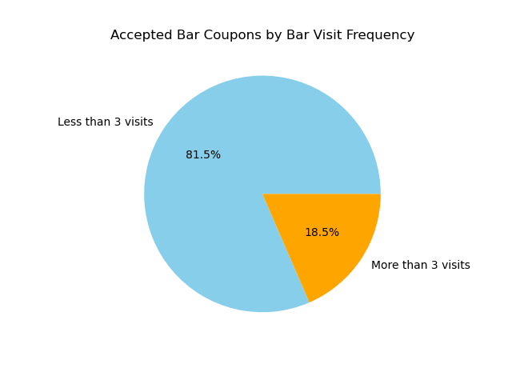

# Module 5.1: Will the Customer Accept the Coupon?

Hello and welcome to my repo.

As part of this repo, I will exploring the coupons.csv dataset under data folder. To learn more about this dataset, please follow [this](https://archive.ics.uci.edu/dataset/603/in+vehicle+coupon+recommendation) link.

### Goal:

* exploring the data,
* creating statistical summaries
* demonstrating differences in those who accepted and rejected the coupon.
* creating visualizations.

### Data Cleaning Decisions:

1. `car` column: Removed due to high missing values (99%).
2. Other columns: Missing values replaced with 'never' (safe assumption for non-visits).
   
3. `Age` column was not entirely numeric (int). I replaced string value `50plus` with `51` and `below21` with `20`. And converted the entire column to then int64. by doing this, I was easily able to add filter operations with `<` and `>`

### Data Exploration

* Generally drivers accepting coupon is around 56.8%. 

There are 5 different type of coupons. Below, we will be exploring Bar coupon and Coffee house coupon.

### Bar coupon Exploration

* In General, only 41% of drivers accept bar coupons.
* Acceptance of bar coupons is much higher among drivers with fewer than three bar visits. 
* 70.47% of bar coupon acceptances among drivers with more than 3 bar visits are from those over age 25. And drivers with more than one bar visit and under age had similar acceptance percentage (72.17%)
* Among drivers with more than one bar visit, no kids, and non-farming/fishing/forestry occupations, 71.32% accepted and 28.68% rejected the bar coupon.

Based on observations above, I see that drivers with age less than 30 and that are frequent bar goers and without kids is likely to accept the bar coupon.

### Coffee house coupon Exploration

Reasons for choosing coffee house coupon is because 3rd of the drivers in the dataset had accepted the coffee house coupon and I thought it would be good to explore this. 

* Drivers accepted more coffee house coupon destination was not urgent.
  
* As you can see below, drivers whos occupation is student or unemployed were likely to accept coffee house coupon.
  
* Drivers between the ages of 20 and 25 had a higher rate of coupon acceptance, while other age groups were more likely to reject the coupons. 
  

### Propotion of Accepted coupons
Drivers were likely to accept CarryOut, Coffehouse and Restaurant (<20$) coupons than others. 

